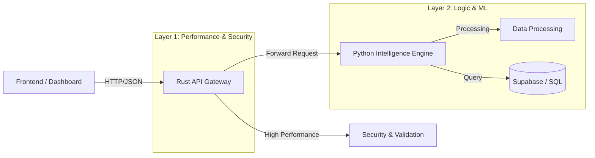

# Swasthya Backend Architecture 🚀

## Hybrid High-Performance Systems

The **Swasthya** backend employs a modern **hybrid microservices architecture** designed to balance high-concurrency performance with advanced data science capabilities. It combines **Rust** for the edge gateway and **Python** for the intelligence engine.

---

## 🏗️ Architecture Overview

The system is composed of two primary layers:



### **Layer 1: Rust API Gateway (`/rust-predictions-api`)**
**Role:** The Shield & Traffic Controller.  
**Tech Stack:** Rust, Axum, Tokio, Tower-HTTP.

The entry point for all client requests. It is built with **Rust** to enforce memory safety, maintain low latency under high load, and manage request validation before touching the heavy compute layer.

- **⚡ Blazing Fast:** Asynchronous I/O using Tokio runtime for handling thousands of concurrent connections.
- **🛡️ Type-Safe Validation:** Strict request schema validation ensures malformed data never reaches the core logic.
- **🔒 Security:** Centralized CORS, rate limiting (extensible), and header sanitization.
- **Error Handling:** Unified error responses masking internal service details.

### **Layer 2: Python Intelligence Engine (`/app`)**
**Role:** The Brain.  
**Tech Stack:** Python, FastAPI, Pandas, Scikit-learn (logic), Pydantic.

The computational core where business logic and data analysis reside. It focuses on expressiveness and rich data libraries.

- **🤖 Predictive Analytics:** Overload risk forecasting and outbreak severity scoring.
- **🧠 Decision Intelligence:** Resource allocation algorithms (Mobile units, Facility placement).
- **📊 Simulation:** "What-if" analysis for intervention impacts.
- **Data Integration:** Seamless connectivity with Supabase for realtime healthcare data.

---

## 🎯 Frontend Applications

### **Government Dashboard (`/gov-app`)**
**Live Deployment:** [https://swasthya-neon.vercel.app/dashboard](https://swasthya-neon.vercel.app/dashboard)  
**Tech Stack:** Next.js 16, TypeScript, Tailwind CSS, Framer Motion, Lucide React.  
**Role:** The Command Center for Public Health Officials.

The **gov-app** is a sophisticated web dashboard designed specifically for government health administrators and policymakers. It provides real-time insights, predictive analytics, and decision-support tools to manage public health crises effectively.

#### **🏗️ Architecture & Features**

**Core Dashboard Components:**
- **📊 Real-Time KPI Dashboard:** Live metrics including hospital occupancy rates, ICU utilization, outbreak hotspots, and resource availability across districts.
- **🗺️ Interactive Heatmaps:** Geographic visualization of disease spread, facility overload risks, and population density overlays.
- **📈 Predictive Analytics:** 7-day forecast charts for bed/ICU overload risks and outbreak severity progression.
- **🚨 Alert Management:** Priority-based notification system for critical health events and resource shortages.
- **📋 Capacity Planning:** Dynamic facility capacity tracking with automated alerts for threshold breaches.

**Advanced Features:**
- **🎯 Scenario Simulation:** "What-if" analysis tools for testing intervention strategies (e.g., adding mobile units, opening new clinics).
- **📱 Mobile-Optimized:** Responsive design ensuring accessibility on tablets and smartphones for field officials.
- **🔄 Real-Time Synchronization:** WebSocket-like updates from the backend intelligence engine for live data streaming.
- **🎨 Modern UI/UX:** Glassmorphism effects, smooth animations, and intuitive navigation following government accessibility standards.

#### **🔧 Technical Implementation**

**State Management:**
- **Client-Side Caching:** Efficient data fetching with SWR for optimal performance.
- **Error Boundaries:** Comprehensive error handling with user-friendly fallbacks.

**Data Visualization:**
- **Chart.js Integration:** Interactive charts for time-series data and comparative analysis.
- **MapBox Integration:** Custom map layers for geographic health data visualization.

**Security & Compliance:**
- **Role-Based Access:** Different permission levels for district officers, state administrators, and central health ministry officials.
- **Data Encryption:** End-to-end encryption for sensitive health data transmission.
- **Audit Logging:** Complete activity tracking for compliance and accountability.

#### **🚀 Deployment & Scaling**

**Vercel Deployment:**
- **Edge Functions:** Serverless API routes for data processing and authentication.
- **Global CDN:** Optimized delivery with Vercel's worldwide network for fast loading times.
- **Automatic Scaling:** Handles traffic spikes during health emergencies.

**Integration Points:**
- **Backend APIs:** Direct connection to Rust/Python hybrid backend for real-time data.
- **External Systems:** Planned integration with national health registries and emergency response systems.

#### **📱 User Experience Highlights**

- **Intuitive Navigation:** Sidebar menu with quick access to critical sections.
- **Dark/Light Mode:** Adaptive theming for extended use in various environments.
- **Offline Capability:** Progressive Web App features for limited offline functionality.
- **Accessibility:** WCAG 2.1 AA compliance for users with disabilities.

This dashboard serves as the digital nerve center for public health management, enabling data-driven decision-making during health crises and routine operations alike.

---

## 🔌 API Reference & Endpoints

### 1. Prediction Endpoints
**Base URL:** `http://localhost:3001/predict` (Rust Gateway)

| Method | Endpoint | Description | Layer Handled |
|:-------|:---------|:------------|:--------------|
| `POST` | `/overload` | Forecast facility bed/ICU overload risks (7-day window). | **Python** (Forwarded) |
| `POST` | `/outbreak-severity` | Score disease outbreak severity based on reports. | **Python** (Forwarded) |
| `GET` | `/kpis` | Real-time dashboard KPI snapshot (Occupancy, Risks). | **Python** (Forwarded) |

### 2. Recommendation Endpoints
**Base URL:** `http://localhost:8000/api/v1/recommend` (Direct Python Access for Simulators)

| Method | Endpoint | Description |
|:-------|:---------|:------------|
| `POST` | `/mobile-units` | Optimize routes for mobile medical units based on hotspots. |
| `POST` | `/facility-placement` | Suggest optimal locations for new PHCs/Clinics. |
| `POST` | `/simulate/intervention` | Calculate impact of adding beds/clinics. |

### 3. System Endpoints
| Method | Endpoint | Description | Service |
|:-------|:---------|:------------|:--------|
| `GET` | `/health` | Gateway health status. | **Rust** |
| `GET` | `/api/v1/health` | Intelligence Engine status. | **Python** |

---

## 🚀 Getting Started

### Prerequisites
- **Rust:** `cargo` (Latest stable)
- **Python:** Python 3.9+
- **Supabase:** configured in `.env`

### Step 1: Start the Python Intelligence Engine
This service performs the actual calculations.

```bash
cd backend
# Create virtual environment (optional but recommended)
python -m venv venv
.\venv\Scripts\activate  # Windows
# source venv/bin/activate # Mac/Linux

# Install dependencies
pip install -r requirements.txt

# Run Service (Port 8000)
uvicorn app.main:app --host 0.0.0.0 --port 8000 --reload
```
*Wait for: `Application startup complete.`*

### Step 2: Start the Rust Gateway
This service protects the engine and serves the frontend.

```bash
cd backend/rust-predictions-api

# Check configuration
# Ensure .env has RUST_PORT=3001 and PYTHON_INTELLIGENCE_URL=http://localhost:8000

# Run Gateway (Port 3001)
cargo run
```
*Wait for: `🚀 Rust Predictions API listening on 0.0.0.0:3001`*

---

## 📂 Directory Structure

```plaintext
backend/
├── app/                        # 🐍 Python Intelligence Engine
│   ├── api/                    # Route handlers
│   ├── core/                   # Config & Logging
│   ├── services/               # Logic: Overload, Outbreak, Routing
│   ├── data/                   # Supabase & Feature Engineering
│   ├── schemas/                # Pydantic Models
│   └── main.py                 # FastAPI Entry point
│
├── rust-predictions-api/       # 🦀 Rust API Gateway
│   ├── src/
│   │   ├── core/               # Env mapping
│   │   ├── routes/             # Route Aggregation
│   │   ├── services/           # HTTP Client (Reqwest)
│   │   ├── schemas/            # Serde Structs
│   │   └── main.rs             # Axum Entry point
│   └── Cargo.toml              # Rust Dependencies
│
└── requirements.txt            # Python Dependencies
```

## 🛡️ Why This Hybrid Approach?

1. **Security:** The Rust gateway acts as a firewall. Python services are never exposed directly to the public internet in production; only the Rust gateway is accessible.
2. **Resilience:** If the Python service experiences a heavy GC pause or crashes, the Rust gateway handles the failure gracefully, returning structured error responses (503 Service Unavailable) instead of hanging connections.
3. **Scalability:** Rust efficiently handles thousands of idle connections (like WebSockets or keeping-alive HTTP/2), while Python only processes active compute requests.
4. **Validation:** Rust's strong typing ensures that "garbage in" never reaches the expensive ML models ("garbage out").

---
*Swasthya Backend Team © 2026*