# Swasthya Ecosystem 🏥🇮🇳

**Swasthya** is a comprehensive, AI-driven digital healthcare infrastructure designed to bridge the gap between proper healthcare delivery, efficient administration, and citizen accessibility. 

The ecosystem is built on a high-performance hybrid backend and consists of three specialized applications that work in tandem to create a unified healthcare network.

## 🚀 Live Demos

**Hackfest 2026 Submission**

- **🏛️ Government App:** [https://swasthya-neon.vercel.app/](https://swasthya-neon.vercel.app/)
- **🏥 Hospital App:** [https://swasthya-eb2y.vercel.app/](https://swasthya-eb2y.vercel.app/)
- **👥 Public App:** [https://swasthya-6a8z.vercel.app/](https://swasthya-6a8z.vercel.app/)

---

## 🌐 Ecosystem Overview

The Swasthya ecosystem operates on a unified data layer where information flows seamlessly between citizens, healthcare providers, and government administrators.

### **System Architecture**

High-level view of the complete system interaction:

```mermaid
graph TD
    user((User))
    admin((Admin/Gov))
    doc((Doctor))

    subgraph "Frontend Layer (Next.js 16)"
        PublicApp[👥 Public App]
        GovApp[🏛️ Gov App]
        HospitalApp[🏥 Hospital App]
    end

    subgraph "Edge Layer (High Performance)"
        RustGW[🛡️ Rust API Gateway]
    end

    subgraph "Logic & ML Layer (Python)"
        PyBackend[🧠 Python Intelligence Engine]
        MLMap[🗺️ Outbreak & Prediction Models]
        PyBackend --> MLMap
    end

    subgraph "Data Layer"
        Supabase[(Supabase DB)]
    end

    user <--> PublicApp
    admin <--> GovApp
    doc <--> HospitalApp

    PublicApp -->|HTTPS| RustGW
    GovApp -->|HTTPS| RustGW
    HospitalApp -->|HTTPS| RustGW

    RustGW <-->|gRPC/HTTP| PyBackend
    PyBackend <--> Supabase
```



### **The Three Pillars**

1.  **🏛️ Gov-App (The Command Center):**  
    Empowers health officials with real-time surveillance, predictive analytics, and resource allocation tools to manage public health effectively.

2.  **👥 Public-App (The Citizen Portal):**  
    A user-friendly interface for citizens to access healthcare services, book appointments, find clinics, and receive health alerts.

3.  **🏥 Hospital-App (The Operational Hub):**  
    A management tool for hospitals to update bed availability, manage appointments, and coordinate with the central network.

---

## 🏛️ Government App (`/gov-app`)
**Role:** Command Center & Decision Support System

The **Gov-App** is a sophisticated dashboard for policymakers and health administrators. It transforms raw data into actionable intelligence.

### **Key Features**
-   **📊 Real-Time Surveillance:** Monitor disease outbreaks, hospital occupancy (ICU/General), and medical supply levels across the state/city in real-time.
-   **📈 Predictive Analytics:** AI-powered forecasting for potential disease outbreaks and hospital overload risks 7-14 days in advance.
-   **🚨 Crisis Management:** Automated alert system for critical thresholds (e.g., Dengue hotspots, Oxygen shortage).
-   **🗺️ Interactive Heatmaps:** Geospatial visualization of health metrics to identify vulnerable zones.
-   **📋 Resource Allocation:** Dynamic tools to deploy mobile medical units and redirect resources to affected areas.

**Tech Stack:** Next.js 16, TypeScript, Tailwind CSS, Recharts, Framer Motion.

---

## 👥 Public App (`/public-app`)
**Role:** Citizen Engagement & Service Delivery

The **Public-App** is the front-facing interface for the general population, ensuring healthcare is accessible to everyone.

### **Key Features**
-   **🏥 Facility Locator:** Find nearest hospitals, clinics, and pharmacies with live operational status.
-   **📅 Appointment Booking:** Seamless scheduling for OPD and specialist consultations at government and empanelled private hospitals.
-   **🤖 AI Health Assistant (MediBot):** A multilingual chatbot for symptom checking, health advice, and navigation assistance.
-   **🚑 Emergency Services:** One-touch access to ambulance services (108) and emergency lines.
-   **🔔 Health Alerts:** Personalized notifications about local health hazards (e.g., "High Dengue Risk in your area").
-   **📍 Smart Routing:** Intelligent navigation to the nearest available facility based on current traffic and hospital load.

**Tech Stack:** Next.js 16, Leaflet Maps, GSAP Animations, Lucide React, Groq SDK (AI).

---

## 🏥 Hospital App (`/hospital-app`)
**Role:** Facility Operations & Patient Management

The **Hospital-App** serves as the operational interface for doctors, nurses, and hospital administrators.

### **Key Features**
-   **🛏️ Live Bed Management:** Real-time updating of ICU, Oxygen, and General bed availability.
-   **🗓️ OPD Management:** Streamlined queue management and appointment scheduling for doctors.
-   **🩺 Patient Records:** Secure access to patient medical history and digital prescriptions.
-   **📦 Inventory Tracking:** Monitoring of essential drugs and medical equipment stocks.
-   **🔗 Network Integration:** Syncs local hospital data with the central government dashboard instantly.

**Tech Stack:** Next.js, Tailwind CSS, Shadcn UI.

---

## 🔄 System Workflows

### 1. Emergency Response Flow
How a critical alert propagates through the system in real-time.

```mermaid
sequenceDiagram
    participant P as 👥 Citizen (Public App)
    participant B as ⚡ Backend (Rust+Python)
    participant H as 🏥 Hospital (Hospital App)
    participant G as 🏛️ Gov Admin (Gov App)

    P->>B: 🚨 SOS / Critical Symptom Report
    B->>H: Alert Nearest Hospital (Prepare Bed)
    B->>G: Update Heatmap (Outbreak Potential)
    H->>P: Confirm Ambulance Dispatch
    G->>P: Send Geo-fenced Health Advisory
```



### 2. Predictive Analytics Pipeline
How data transforms into actionable insights.

```mermaid
flowchart LR
    H[🏥 Hospital Beds Updated] -->|Real-time Data| R[🛡️ Rust Gateway]
    R -->|Ingest| P[🧠 Python Engine]
    P -->|Process| M[🤖 ML Models]
    M -->|Forecast| D[Update Prediction DB]
    D -->|Visualize| G[🏛️ Gov Dashboard]
    
    style H fill:#e1f5fe,stroke:#01579b
    style G fill:#fff3e0,stroke:#e65100
    style P fill:#f3e5f5,stroke:#4a148c
```



---

## ⚙️ Hybrid Backend Architecture (`/backend`)
**Role:** The High-Performance Core

The backend employs a **Hybrid Microservices Architecture** that combines the speed of Rust with the data science capabilities of Python.

### **Layer 1: Rust Edge Gateway (`/rust-predictions-api`)**
-   **Role:** The Shield & Traffic Controller.
-   **Tech:** Rust, Axum, Tokio.
-   **Function:** Handles high-concurrency requests, validation, rate limiting, and security before routing to the logic layer. ensuring sub-millisecond latency.

### **Layer 2: Python Intelligence Engine (`/backend/app`)**
-   **Role:** The Brain.
-   **Tech:** Python, FastAPI, Pandas, Scikit-learn.
-   **Function:** Handles complex business logic, AI/ML model inference (for outbreak prediction), data processing, and database interactions.

---

## 🌟 Key Impact & Capabilities

| Feature | Description | Impact |
| :--- | :--- | :--- |
| **Zero-Latency Routing** | Rust-based edge gateway handles thousands of requests per second. | **<50ms** API response time ensured even during high load. |
| **Predictive AI** | Python models analyze historical data to forecast outbreaks. | **7-Day** advance warning for resource allocation. |
| **Unified Data Sync** | Real-time sync between Hospitals and Gov dashboard. | **100%** transparency in bed availability. |
| **Localized Access** | Multilingual support and location-based advisories. | **Accessibility** for diverse populations. |

---

## 🚀 Getting Started

### **Prerequisites**
- Node.js 18+ (with npm)
- Python 3.10+
- Rust (latest stable version with Cargo)
- Docker (optional, for containerized deployment)

### **Step-by-Step Setup Guide**

#### **Step 1: Clone and Navigate to Project**
```bash
git clone <repository-url>
cd swasthya-ecosystem
```

#### **Step 2: Set Up Python Backend**
```bash
# Navigate to backend directory
cd backend

# Create virtual environment
python -m venv myvenv
myvenv\Scripts\activate  # On Windows
# source myvenv/bin/activate  # On macOS/Linux

# Install dependencies
pip install -r requirements.txt

# Run the Python backend
uvicorn app.main:app --reload --host 0.0.0.0 --port 8000
```

#### **Step 3: Set Up Rust API Gateway**
```bash
# Open new terminal and navigate to Rust API
cd rust-predictions-api

# Build and run the Rust service
cargo run
```

#### **Step 4: Set Up Frontend Applications**

**For Government App:**
```bash
cd gov-app
npm install
npm run dev
# Access at http://localhost:3000
```

**For Public App:**
```bash
cd public-app
npm install
npm run dev
# Access at http://localhost:3001
```

**For Hospital App:**
```bash
cd hospital-app
npm install
npm run dev
# Access at http://localhost:3002
```

#### **Step 5: Verify Installation**
- Python Backend: http://localhost:8000/docs (FastAPI docs)
- Rust Gateway: Check terminal for successful compilation
- Frontend Apps: Visit respective localhost URLs

### **Alternative: Docker Setup (Optional)**
```bash
# Build and run with Docker Compose
docker-compose up --build
```

---

**Swasthya** — *Empowering Health through Data.*
